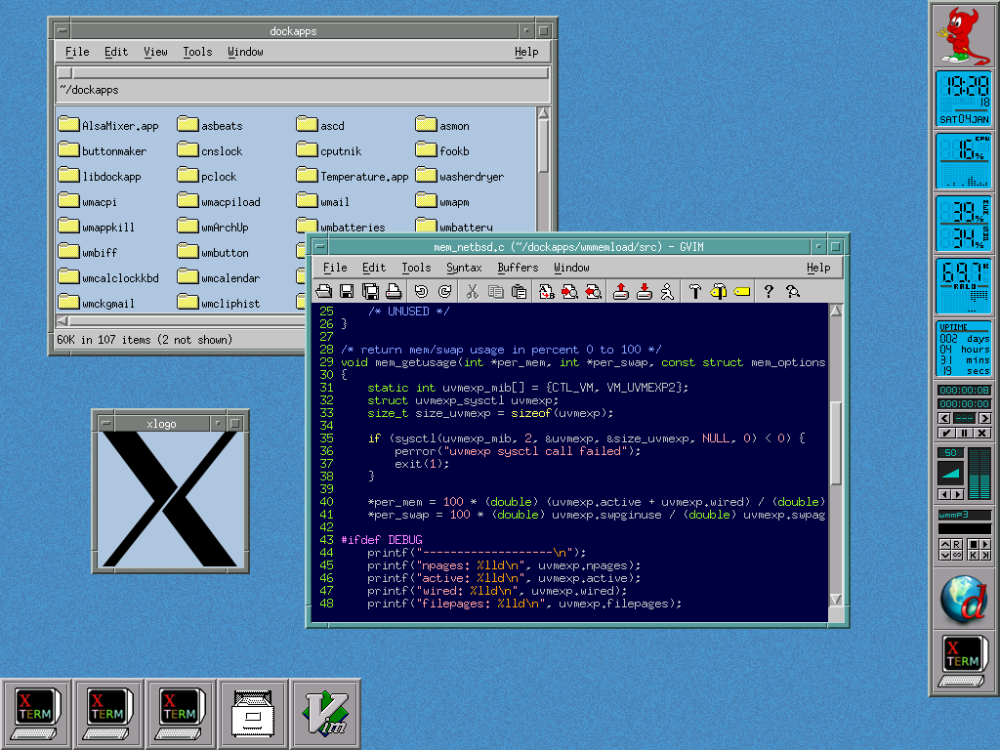

## Overview

PMDock (poor man's dock) is an X11 panel for hosting WindowMaker/AfterStep
[dockapps](https://www.dockapps.net/) and simple application launchers
in window managers without a native dock.

I wrote it mainly to use with EMWM on my
[vintage ThinkPad](https://luke8086.dev/netbsd-on-thinkpad-380z.html).



## Requirements

- `gcc` or `clang`
- `make`
- `pkg-config`
- `libX11`
- `libXpm`
- `Imlib2`

## Building

```bash
$ make
```

## Usage

Compared to WindowManager's dock, PMDock is not interactive.
All dockapps and launchers must be specified on startup using
command line arguments.

Since PMDock interferes with handling of application windows, it's
recommended to start it before the window manager.

Typically it should be added to the `~/.xinitrc` file with the `-d`
option, which waits for all dockapps to be swallowed and then
daemonizes.

### Available options

```
pmdock [OPTIONS]

Options:
  -a            Show on all virtual desktops
  -A            Show on top of all windows
  -x POSITION   X coordinate (default: 0)
  -y POSITION   Y coordinate (default: 0)
  -s SIZE       Tile size in pixels (default: 64)
  -b IMAGE      Tile background image (default: tile-default.png)
  -H            Horizontal layout (default: vertical)
  -D DECOR      Window decorations hints (default: 0x00)
  -f FUNCS      Window functions hints (default: 0x00)
  -d            Daemonize after swallowing all dockapps
  -r NAME       Resource name for dockapp in the next tile
  -i ICON       Icon path for launcher in the next tile
  -c COMMAND    Command to execute in the next tile
  -t TYPE       Add tile (dockapp or launcher)
  -v            Show debug messages
  -h            Display this help message
```

### Adding dockapps

Dockapps are configured by passing a sequence of `-c COMMAND -r NAME -t dockapp`
options, for example:

```bash
pmdock \
  -c "wmclockmon" -r "wmclockmon" -t dockapp \
  -c "wmbattery" -r "wmbattery" -t dockapp
```

The `NAME` must match the first part of the dockapp's WM_CLASS property
(`res_name`). To look it up, start the dockapp, run `xprop WM_CLASS`, and
click on the dockapp window:

<pre><code>$ xprop WM_CLASS
WM_CLASS(STRING) = <b>"wmclockmon"</b>, "DockApp"
</code></pre>

You can also use `xwininfo -root -tree` and search for the dockapp:

<pre><code>$ xwininfo -root -tree
...
    0x3000002 "wmclockmon": (<b>"wmclockmon"</b> "DockApp")  1x1+6+32  +6+32
...
</code></pre>

Usually the name will be the same as the binary name but there are exceptions.

### Adding launchers

Launchers are configured by passing a sequence of `-c COMMAND -i ICON -t launcher`
options, for example:

```bash
pmdock \
  -c "firefox" -i "firefox.png" -t launcher \
  -c "thunderbird" -i "thunderbird.png" -t launcher
```

### Setting window properties

Pmdock uses the `_MOTIF_WM_HINTS` property to set window decorations
and functions. By default the main window doesn't have any decorations
(like border) nor functions (like resize). If you want, you can enable
them using `-f` and `-D`.

The value for `-f` is a bitwise OR of the following flags:

- `0x01` - Resize
- `0x02` - Move
- `0x04` - Minimize
- `0x08` - Maximize
- `0x10` - Close

The value for `-D` is a bitwise OR of the following flags:

- `0x01` - Border
- `0x02` - Resize
- `0x04` - Title
- `0x08` - Menu
- `0x10` - Minimize
- `0x20` - Maximize


